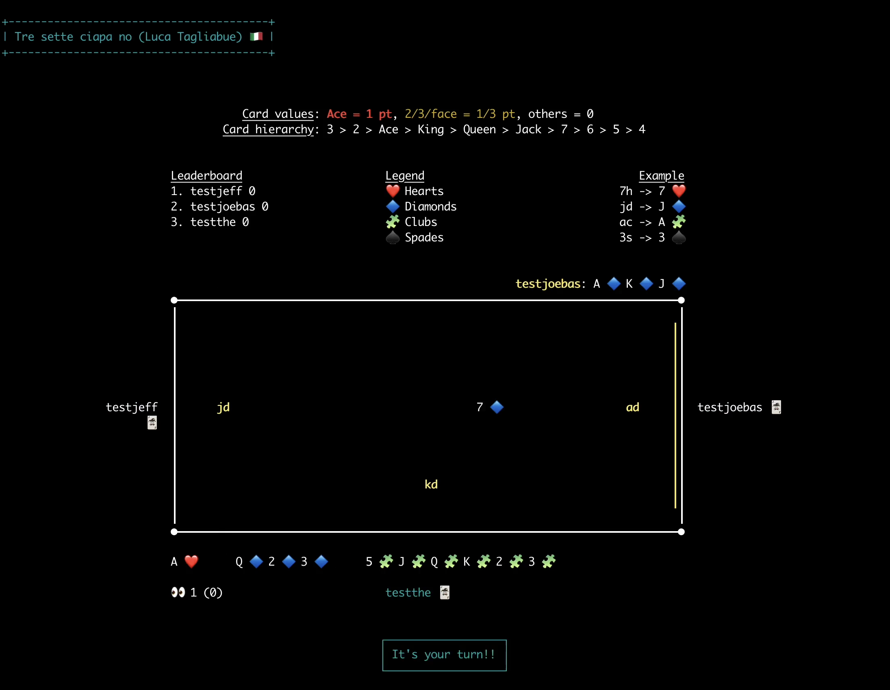

# 37no (Tressette Variant) - Rules and Description

Alongside **Scopa** and **Briscola**, **Tressette** is one of the great classics of Italian card games. It is widely played throughout Italy, not only in its traditional form but also in numerous local variants, some more or less codified. One of the best-known variants is the **Traversone**, also called **“Ciapa no”** (in Milanese dialect), **“Ass’e mazzo”** (Neapolitan dialect meaning ‘ace of the deck’), **“Rovescino”**, **“Tressette a perdere”**, or **“Tressette a non prendere”**.

## Objective

As the alternative names suggest, the goal of 37no is to achieve the **lowest possible score**, unlike traditional Tressette where the highest score wins. At the start of the game, a score limit is set—commonly 21, 31, 41, or 100 points—or alternatively, a maximum number of deals (hands) is fixed. When the limit is reached or the deals are exhausted, players (or teams) compare scores, and the player with the **lowest score wins**.

## Players and Deck

- Number of players: from **3**.
- Unlike traditional Tressette, **no teams are formed**; every player competes individually.
- Deck: any regional Italian 40-card deck can be used (e.g., Neapolitan, Piacentine, Tuscan). From that deck the 4 of spades is removed.
- Card hierarchy (from highest to lowest):  
  **3 > 2 > Ace > King > Queen > Jack > 7 > 6 > 5 > 4**.

## Card Values

- **Ace:** 1 point
- **2, 3, and face cards:** 1/3 point each
- **Other cards:** no value (called “scartine”)

The total points available per deal add up to **11 points**:

- 1 for each Ace for a combined total of 4 points
- 1/3 for each face, 2, or 3 for a combined total of 7 points

## Gameplay

- The dealer shuffles and deals **thirteen cards face down** to each player.
- **Firt player in the trick** (called “di mano”) can choose any card he want.
- Players must follow suit (play a card of the same suit as the first card played in the trick).
- If a player has no cards of the suit led, they may play any card.
- The player who plays the **highest card of the suit led** wins the trick and collects the cards.
- After all cards are played, players declare their points, except the last player who took a trick.
- Last player’s points are calculated by subtracting the sum of the other players’ points from 11.

---

## Summary

| Aspect                | Details                                           |
| --------------------- | ------------------------------------------------- |
| Players               | 3                                                 |
| Deck                  | 39-card Italian regional deck                     |
| Card hierarchy        | 3 > 2 > Ace > King > Queen > Jack > 7 > 6 > 5 > 4 |
| Card values           | Ace = 1 pt, 2/3/face = 1/3 pt, others = 0         |
| Total points per deal | 11                                                |
| Objective             | Lowest score wins                                 |
|                       |

---

## How to Start and Play the Game

By following these steps, you can play with your friends without deploying the game to an external server. All account data and game statistics are saved locally in a JSON file on your computer.

### Creating a Self-Signed TLS Certificate

To run the game with TLS, you need to create your own self-signed SSL certificate and private key. This is necessary because the app expects TLS certificates for secure communication.

Run this OpenSSL command in the root of the repository to generate them:

```bash
openssl req -newkey rsa:2048 -nodes -keyout server.key -x509 -days 365 -out server.crt
```

### Run the game

1. **Install [bore](https://github.com/ekzhang/bore)** — a tool to expose your local server to the internet ([Click here](https://github.com/ekzhang/bore))

2. **Start the game server** - Clone this repository and navigate into its root directory. Then, run the following command to fetch dependencies, compile the project, and start the server:
   `mix deps.get && mix compile && mix run`

3. **Expose your the local port (e.g., 4000) using bore** - In a second terminal run
   `bore local 4000 --to bore.pub`.
   Bore will provide you with a public hostname and port, for example: `bore.pub:12345`

4. **Connect to the game server using OpenSSL** In a third terminal run (replace `<port>` with the port given by bore)
   `openssl s_client -connect bore.pub:<port> -tls1_3 -ign_eof`

5. **Start playing!** Now you can share the OpenSSL command with your friends and begin playing together.

---

### Notes

- Make sure you have Elixir and OpenSSL installed on your machine.
- The game uses TLS 1.3 for secure communication.
